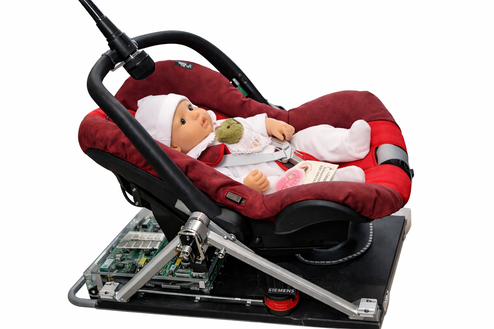

# Rock Your Baby (RYB) — Motor/Output Module (M5Stack)

This repository contains my work for the **Rock Your Baby (RYB)** first-year EE project at TU/e: specifically the **Motor/Output Module** responsible for generating two PWM control signals that represent the cradle’s **rocking frequency** and **rocking amplitude**.

## Project context (short)
The full RYB system is a bio-feedback controller for a rocking cradle. It aims to reduce the baby’s simulated stress level using two measured inputs (heartbeat LED and crying sound) and two outputs (PWM signals controlling rocking frequency and amplitude).

## What this module does
- Receives (or is configured with) two discrete levels:
  - `freqlvl` (1–5): frequency level  
  - `ampllvl` (1–5): amplitude level
- Generates **two 1 kHz PWM signals** from the M5Stack (ESP32) using `ledc`:
  - one PWM output for frequency control
  - one PWM output for amplitude control
- Displays the current computed values on the M5Stack LCD.

> Note: On the cradle setup, the M5Stack outputs are **3.3V logic**. External power switching / amplification is required to meet the cradle interface (e.g., ~12V, higher current), which is part of the overall system hardware.

## Hardware / Pins
- **M5Stack (ESP32)**
- PWM outputs:
  - GPIO **12** → PWM channel 1 (frequency level signal)
  - GPIO **15** → PWM channel 2 (amplitude level signal)

## How to run
1. Open the `.ino` file in the **Arduino IDE**.
2. Install/select the **M5Stack board support** and required library:
   - `M5Stack`
3. Flash to your M5Stack.
4. Set `freqlvl` and `ampllvl` in the code (or extend it to receive them from the communication module).

## Code behavior (mapping)
- Valid ranges: `freqlvl ∈ [1..5]`, `ampllvl ∈ [1..5]`
- Duty cycle mapping used in the implementation:
  - `ledcWrite(channel, 51*(level-1))` (8-bit resolution, so 0–255)
- Displayed values:
  - Frequency displayed as `0.2 + 0.15*(freqlvl-1)` (Hz)
  - Amplitude displayed as `ampllvl * 10` (%)

## Notes / limitations
- This repo focuses on the **output module only**.
- Integration with the full system (I2C communication, decision-making module, sensor modules, and power switching) is outside the scope of this code file, but was part of the complete project.

## License
This project is published for educational and demonstration purposes as part of an academic course.
